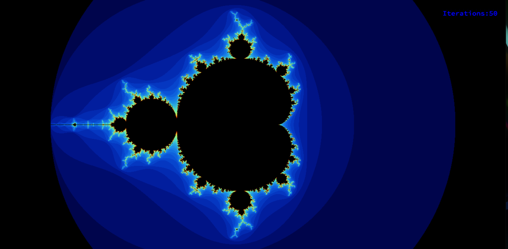
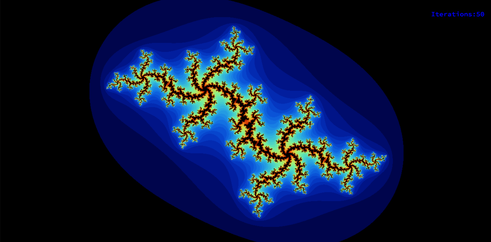
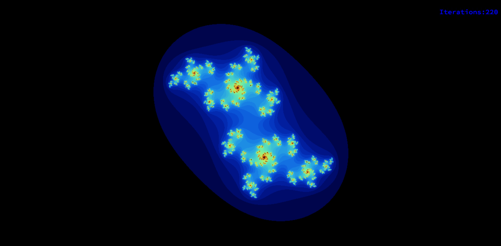
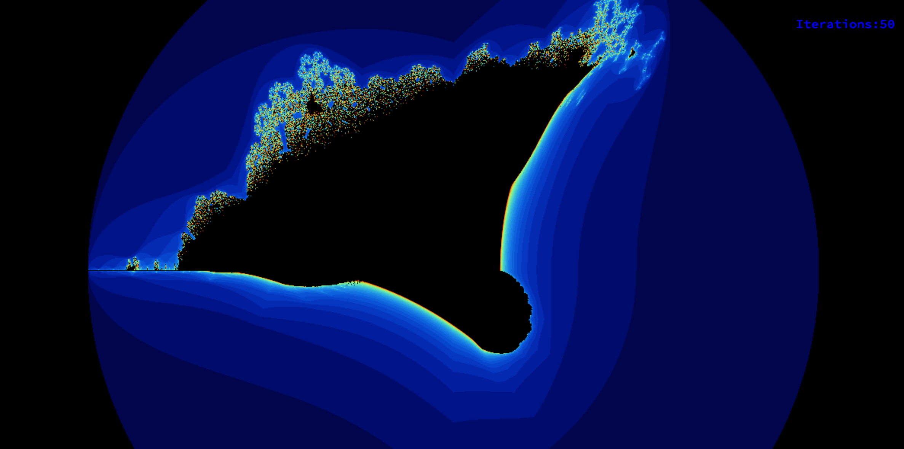
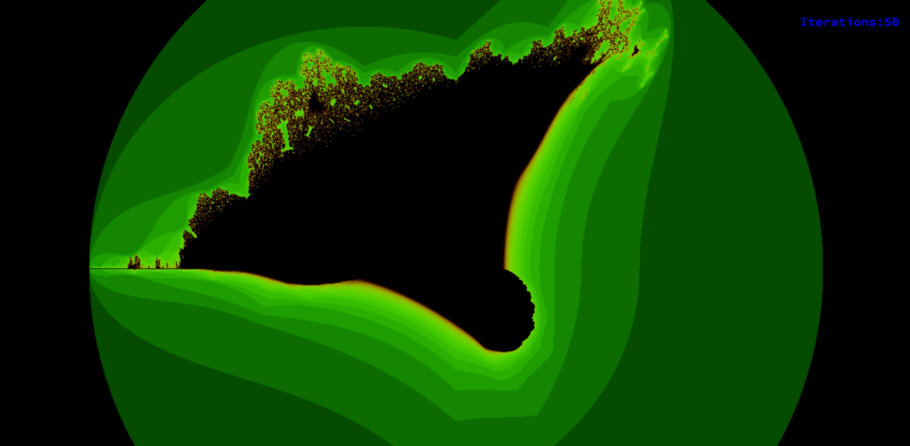

# Fract-ol 

## Overview

This program generates and displays various fractals, including the Julia set and the Mandelbrot set. It offers interactive features such as zooming, parameter customization, and smooth graphic management.

## Features

### Basic Features

- **Mandelbrot Set:** Press `1` to view the Mandelbrot set.
- **Julia Set:** Press `2` to view the Julia set.
- **Burning Ship:** Press `3` to view the Burning Ship fractal.

### Interactive Controls

- **Zooming:** Use the mouse wheel to zoom in and out.
- **Parameter Customization:** Pass different parameters via the command line to create unique Julia sets.
- **Animation for Julia Set:** Press `S` to start and stop the animation.
- **Adjust Animation Speed:** Press `4` to decrease the speed, and `5` to increase it.
- **Color Customization:** Press `G` for green and `B` for blue color range.
- **Iteration Increase:** Press `+` to increase the number of iterations for more detail.
- **Iteration Decrease:** Press `-` to decrease the number of iterations for less detail but more performance.

### Graphic Management

- **Window Controls:** Press `ESC` or click the window's cross to close the window and quit the program.
- **Smooth Transition:** Ensures smooth window management, including switching to another window and minimizing.

### Bonus Features

- **Additional Fractal:** Discover more than a hundred different types of fractals by exploring the bonus section.
- **Dynamic Zoom:** Zoom follows the actual mouse position for enhanced user experience.
- **Move View:** Use arrow keys to move the view.
- **Color Range Shift:** Experience psychedelic effects by shifting the color range.

## Usage

1. Clone the repository: `git clone https://github.com/vasilisalmpanis/42`
2. Navigate to the project directory: `cd fractol`
3. Compile the program: `make`
4. Run the program:
   ```
   ./fractol "Mandelbrot"
   ```
   ```
   ./fractol "Julia " "number from -2 to 2 for x" "number from -2 to 2 for y"
   ```
   ```
   ./fractol "Burning ships"
   ```

## Screenshots

### Mandelbrot Set


### Julia Set



### Burning Ship



